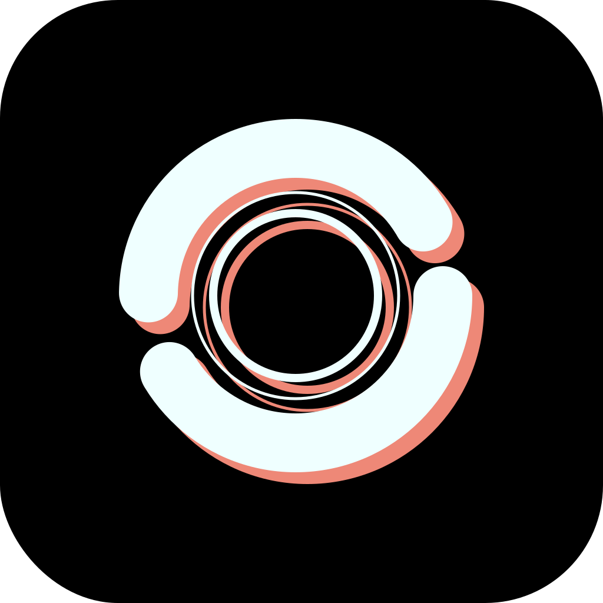

<p align="center">
    
</p>

<h1 align="center"> Alcubierre </h1>

## How it works

[](https://deepwiki.com/ValKmjolnir/Alcubierre)

We develop this engine based on
[__raylib__](https://github.com/raysan5/raylib), for fun and learning.
This engine aims to create a 3D engine with specific shapes for Alcubierre metric.

## Repository Structure

- [assets](assets): Assets.
- [bin](bin): Binaries of raylib.
- [include](include): Header files.
- [lib](lib): Libraries, share the same structure of include.
  - [object](lib/object): Objects.
  - [rendering](lib/rendering): Rendering passes.
  - [ui](lib/ui): User interface.
  - [utils](lib/utils): Utilities.
- [shaders](shaders): Shaders.

## Build

Support Windows (mingw-w64), MacOS, Linux (not tested).
Build script will automatically unzip raylib binaries and
put them in `build/{name}`. Then build the project using cmake.

```bash
python3 tool/build.py
```

## Todo

- start screen
- main menu
- menu settings
  - antialiasing:
    - FXAA (not fully implemented)
    - SMAA (not fully implemented)
    - SSAA (1.25x, 1.5x, 1.75x, 2x)
  - max fps
